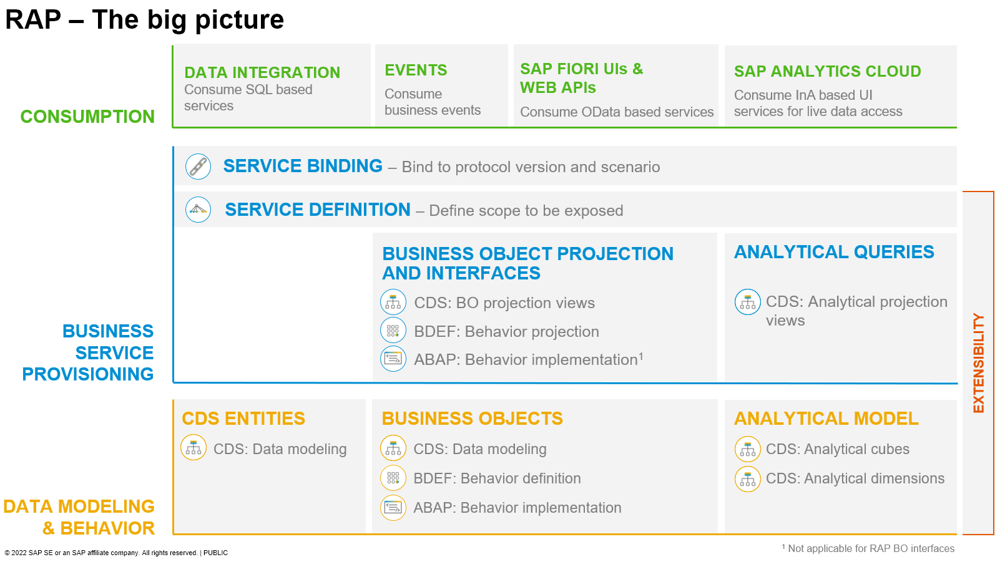

# AD162 - Build and Extend Apps with ABAP RESTful Application Programming Model

## Description

This repository contains the material for the SAP TechEd 2022 session called AD162 - Build and Extend Apps with ABAP RESTful Application Programming Model.  

## Overview

Do you want to build modern, cloud-ready, ABAP-based applications or extensions on SAP Business Technology Platform? Then ABAP RESTful application programming model is the right choice for you. Join us to learn how to use the latest and greatest ABAP capabilities, such as the enhanced core data services and ABAP programming language with its entity manipulation language and business services, to build transactional SAP Fiori apps. Focus is on the back-end implementation of SAP Fiori apps.

#### About the ABAP RESTful Application Programming Model
  > The ABAP RESTful Application Programming Model (RAP) is a set of concepts, tools, languages, and powerful frameworks provided on the ABAP platform. It supports the efficient development of innovative and cloud-ready enterprise applications, as well as the extension of SAP standard applications in an upgrade-stable way in the cloud and on-premise.

Click to expand!

> RAP is an enabler for improving the user experience and innovating business processes in ABAP-based SAP solutions by leveraging SAP Fiori, SAP HANA, and the cloud. 
> It is a long-term strategic solution for ABAP development on SAP’s flagship product SAP S/4HANA, in the cloud and on-premise (as of release 1909), as well as on the SAP BTP ABAP Environment.

>
> The illustration below shows the high-level end-to-end development stack when working with RAP.  
> 
> 
> 
> **Read more**: [Modern ABAP Development with the ABAP RESTful Application Programming Model (RAP)](https://community.sap.com/topics/abap/rap)

## Requirements

The requirements to follow the exercises in this repository are:
- Installation of the latest ABAP Development Tools (ADT) 
- User on a SAP BTP ABAP Environment or SAP S/4HANA 2022 (or higher) systems - e.g. SAP BTP ABAP Environment Trial

> ⚠**Please note**⚠   
> Session **AD162** is for participants of the on-site event that takes place in Las Vegas.   
> If you have registered for the free virtual session **DT281** please [**navigate to DT281@SAP TechEd in 2022**](https://github.com/SAP-samples/teched2022-DT281/blob/main/README.md)  
> Registered session participants will have access to devices with pre-configured frontend tools and to a dedicated ABAP system while participants of DT281 will use the trial systems.

## Users and Service Key for session AD162

In the dedicated backend system **T22** we prepared users for you 

- username:  RAP100-**###**@teched.sap
- password:  WelcomeRAP!

where **###** is your group number.   

The service key that you have to upload when creating the *ABAP Cloud Project* is stored locally on the laptop in this directory:   

- Service Key: **C:\TecheEd\eclipse_2209\servicekeys**   

## Exercises

Start the exercises [here](https://github.com/SAP-samples/abap-platform-rap-workshops/tree/main/rap1xx/rap100#exercises).

## How to obtain support

Support for the content in this repository is available during the actual time of the online session for which this content has been designed. Otherwise, you may request support via the [Issues](../../issues) tab.

## License
Copyright (c) 2022 SAP SE or an SAP affiliate company. All rights reserved. This project is licensed under the Apache Software License, version 2.0 except as noted otherwise in the [LICENSE](LICENSES/Apache-2.0.txt) file.
